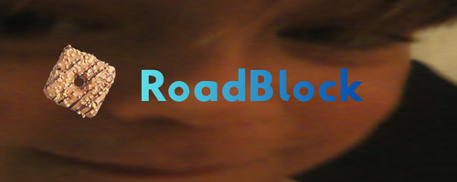

# RoadBlock

RoadBlock is a 3D multiplayer gaming platform built on top of the [Godot Engine](https://godotengine.org/). It provides a set of tools for creating your multiplayer games, with server-client architecture, synchronized state replication and scripting powered by [Luau](https://luau.org/).

## License

Unless otherwise noted:
- Source code is licensed under Mozilla Public License Version 2.0. Please check [LICENSE](/LICENSE) for more info.
- Brand assets, logos, names, and trademarks are not licensed for reuse.
- Third-party assets and native binaries are governed by their own licenses. Please refer to the respective repositories and documentation for more information.
